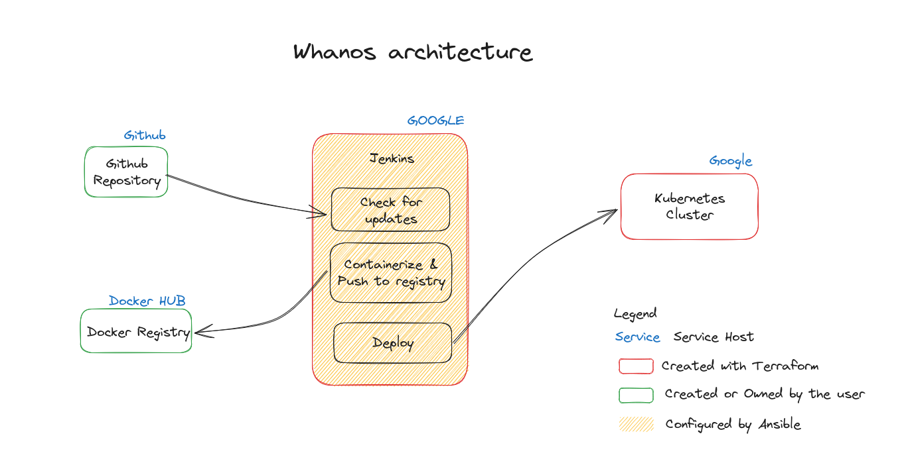

# Project Documentation

## Table of Contents
- [Introduction](#introduction)
- [Project Overview](#project-overview)
- [Folder Structure](#folder-structure)
- [Getting Started](#getting-started)
  - [Prerequisites](#prerequisites)
  - [Setup google cloud](#setup-google-cloud)
  - [Create the service account](#create-the-service-account)
  - [Configure variables on the repository](#configure-variables-on-the-repository)
  - [Deploy the infrastructure](#deploy-the-infrastructure)
  - [Send your docker registry credentials to the cluster](#send-your-docker-registry-credentials-to-the-cluster)
  - [Install and configure Jenkins](#install-and-configure-jenkins)
  - [Access Jenkins](#access-jenkins)
  - [Jenkins private repo](#jenkins-private-repo)
  - [Deploy an app](#deploy-an-app)
- [Folder Structure](#folder-structure-1)
  - [ansible folder](#ansible-folder)
    - [Roles](#roles)
    - [roles/base](#roles)
    - [Jenkins](#jenkins)
    - [Docker](#docker)
    - [Kubectl](#kubectl)
    - [Gcloud](#gcloud)
  - [images folder](#images-folder)
    - [BEFUNGE](#befunge)
    - [C](#c)
    - [JAVA](#java)
    - [JAVASCRIPT](#javascript)
    - [PYTHON](#python)
  - [terraform folder](#terraform-folder)
- [Customization](#customization)
- [Contributing](#contributing)
- [License](#license)
- [Authors](#authors)

## Introduction
Welcome to the documentation for the Whanos project, a collaborative effort by students in the 3rd year curriculum at Epitech. This project aims to establish a powerful DevOps infrastructure, allowing developers to automatically deploy applications into a cluster with ease just by pushing to a GitHub repository.

## Project Overview
The Whanos project involves the integration of Docker, Jenkins, Ansible, and Kubernetes to create an efficient and automated deployment pipeline. As part of the curriculum, this project serves as a hands-on learning experience, demonstrating the synergy of various DevOps tools.

Once configured, the Whanos infrastructure will allow developers to push their code to a GitHub repository, which will trigger a Jenkins job to build the application and push it to a Docker registry. The application will then be deployed to a Kubernetes cluster, where it will be accessible to the public.




## Getting Started

### Prerequisites

To launch this project, you must have a google cloud project link with a [billing account](https://cloud.google.com/billing/docs/how-to/modify-project).
You need to have a docker hub account and a registry created. You need to be connected to your docker hub account on your machine `docker login`.
You must have (or create) a [google cloud project](https://cloud.google.com/appengine/docs/standard/nodejs/building-app/creating-project).
You must also have the following tools installed on your machine:

- [Kubectl](https://kubernetes.io/docs/tasks/tools/)
- [Ansible](https://docs.ansible.com/ansible/latest/installation_guide/intro_installation.html)
- [Gcloud](https://cloud.google.com/sdk/docs/install)
- [Terraform](https://learn.hashicorp.com/tutorials/terraform/install-cli)
- [Docker](https://docs.docker.com/get-docker/)


### Setup google cloud

1. Connect to your google cloud account
```bash
gcloud init
```
2. Set your current project

```bash
# Replace PROJECT_ID with your project id
gcloud config set project PROJECT_ID
```
3. Enable the needed services

```bash
gcloud services enable compute.googleapis.com
gcloud services enable container.googleapis.com
gcloud services enable iamcredentials.googleapis.com
```
4. Install the auth plugin
```bash
gcloud components install gke-gcloud-auth-plugin
```

### Create the service account
It will be used by jenkins to send app to the cluster.
```bash
# Replace PROJECT_ID with your project id
gcloud iam service-accounts create JENKINS-ACCESS --description="Give Jenkins access to cluster" --display-name="Jenkins"
gcloud projects add-iam-policy-binding PROJECT_ID --member="serviceAccount:JENKINS-ACCESS@PROJECT_ID.iam.gserviceaccount.com" --role="roles/container.admin"
gcloud iam service-accounts keys create ansible/roles/gcloud/files/gke_key.json --iam-account=JENKINS-ACCESS@PROJECT_ID.iam.gserviceaccount.com

gcloud auth application-default login
```

### Configure variables on the repository
You must configure the following files on the repository:

Use ansible-vault to create your own secret file.
```bash
echo "PASSWORD" > /tmp/.vault_pass
export ANSIBLE_VAULT_PASSWORD_FILE=/tmp/.vault_pass
```
A schema file is provided in the folder to replace the current one.
`./ansible/group_vars`

Create a `production` file in the `ansible` folder and add the following lines (ip will be replaced after):
```yml
all:
  children:
    jenkins:
      hosts:
        jenkins-registry-1:
          ansible_host: IP
          ansible_port: 22
          ansible_user: dev
          # ansible_become_password:
```

Set the mandatory variables in the file `./terraform/terraform.tfvars`.

### Deploy the infrastructure
```bash
cd terraform
terraform init # Configure the terraform project
terraform plan # See what will be deployed
terraform apply # Deploy the infrastructure
```
The last commmand will take a few minutes to complete and a confirmation will be asked before the deployment.

### Send your docker registry credentials to the cluster
```bash
gcloud container clusters get-credentials $(terraform output -raw kubernetes_cluster_name) --region=$(terraform output -raw region)

# FILE is the path to your docker config file usually located in ~/.docker/config.json
kubectl create secret generic regcred --from-file=.dockerconfigjson=FILE --type=kubernetes.io/dockerconfigjson
```

### Install and configure Jenkins
```bash

sed -i "s/IP/$(terraform output -raw vm_ip_adress)/g" ../ansible/production # This command replace the string IP by the actual ip of the vm

# Replace the string FILL by your docker hub credentials
ansible-playbook -i ../ansible/production ../ansible/playbook.yml -e GKE_PROJECT=$(terraform output -raw project_id) -e GKE_CLUSTER=$(terraform output -raw kubernetes_cluster_name) -e GKE_REGION=$(terraform output -raw region) -e DOCKER_PASSWORD="FILL" -e DOCKER_REGISTRY="FILL" -e DOCKER_USERNAME="FILL"
```

### Access Jenkins
You can get the url of jenkins by running the following command:
```bash
echo "http://$(terraform output -raw vm_ip_adress):8080"
```

### Jenkins private repo
If you want to access a private repo, you must create a credential in jenkins.
The type of the credential must be `Username with password` in the `Jenkins` scope.

### Deploy an app
When you want an app to be deployed online, you should configure the `whanos.yml` on your project accordingly to your needs. The ip adress of the service is displayed in the console output of the job. You then just need to go to this ip at the wanted port to access your app.

## Folder Structure

```bash
    .
    |-- ansible
    |-- docs
    |-- images
    |   |-- befunge
    |   |-- c
    |   |-- java
    |   |-- javascript
    |   |-- python
    |-- terraform
```

### ansible folder

The ansible folder contains all the files used by ansible to configure
th vm.

#### Roles

Roles is the main folder of the ansible project. It contains all the roles used by ansible to deploy the project. Each role is a set of tasks that are executed by ansible. Each role has its own folder. The folder contains the tasks, the vars and the files used by the role.

#### Base

The base role is used to install the dependencies of the project. It is used to install curl, acl, git, etc...

#### Jenkins

The jenkins role is used to install and configure jenkins in the server.

It is separated in 3 folders:

- files
- tasks
- vars


**Files**

The files folder contains the files used for the jenkins jobs.

=> `job_dsl.groovy` is used to create to create and parameter all the jobs in jenkins.

=> `job.sh` is used to detect the project's programing language, build the appropriate docker image and push it to a **Docker hub** private registry. Make it then available to the `kubernetes cluster`.


**Tasks**

The tasks folder contains the tasks used by ansible to install and configure jenkins.
> e.g : Install the plugins, create the jobs, copy the files, etc...

#### Docker

This part is responsible for installing docker on the server.
It will be used to containerize the application.

#### Kubectl

This part is responsible for installing kubectl on the server.
It will be used to communicate with the cluster.


#### Gcloud

This part is responsible for installing gcloud on the server.
It will be used to authenticate to the cluster.


### images folder

This folder contains the Dockerfiles for the various languages supported by the project. Each language has its own folder, which contains the Dockerfile**S** and any other files required to build the image.

Each folder contains in fact 2 dockerfiles, one with a standalone extension and one without. The standalone extension is used to build the image as a standalone container, while the other one is used as a base image if the user wants to add settings args during the build process.

> ℹ️ Every app is built inside an app folder

Here are the specificities of each language:

#### BEFUNGE
**📁 Files:**
 - Dockerfile
 - Dockerfile.standalone
 - befunge_interpretor.py

**🐳 Base image:**
 - python:3.12-alpine

**📙 Explanation:**
 - Here, we created a set of dockerfile to contenerize the befunge language. The interpretor is written in python, so we use the python image as a base image. The interpretor is then copied into the image and the entrypoint is set to the interpretor.

#### C
**📁 Files:**
 - Dockerfile
 - Dockerfile.standalone

**🐳 Base image:**
 - gcc:13.2

**📙 Explanation:**
 - Here, we created a set of dockerfile to contenerize the C language. The gcc image is used as a base image. The entrypoint is set to the gcc command. We then clean all the unecessary files. This is done by removing every files except the executable.

#### JAVA
**📁 Files:**
 - Dockerfile
 - Dockerfile.standalone

**🐳 Base image:**
 - maven:3.9

**📙 Explanation:**
 - Here, we created a set of dockerfile to contenerize the java language. The maven image is used as a base image. The entrypoint is set to the maven command. We then clean all the unecessary files. This is done by removing every files except the **app.jar.**.
 > Here we have a small difference between the standalone and the non-standalone version. The standalone version is a double stage build. The first stage is used to build the app.jar and the second one is used to run the app.jar. The non-standalone version is a single stage build. It is used to build the app.jar and run it.

#### JAVASCRIPT
**📁 Files:**
 - Dockerfile
 - Dockerfile.standalone

**🐳 Base image:**
 - node:20.9

**📙 Explanation:**
 - Here, we created a set of dockerfile to contenerize the javascript language. The node image is used as a base image. The entrypoint is set to the node command.

#### PYTHON
**📁 Files:**
 - Dockerfile
 - Dockerfile.standalone

**🐳 Base image:**
- python:3.12

**📙 Explanation:**
 - Here, we created a set of dockerfile to contenerize the python language. The python image is used as a base image. The entrypoint is set to the python command.


### terraform folder
This folder contains all the files used by terraform to deploy the infrastructure.
The infrastructure is composed of a single vm and a kubernetes cluster.
By default, the cluster is composed of 6 nodes, 2 in each location (eurepe-west1-b, europe-west1-c, europe-west1-d).

## Customization
If you wish to customize the project, you can do so by adding your favorite language to the project. To do so, you will need to create a new folder in the images folder. This folder will contain the Dockerfile**S** and any other files required to build the image.

## Contributing
We welcome contributions to enhance the Whanos project. If you have suggestions, improvements, or bug fixes, feel free to:

1. Fork the repository
2. Create a feature branch
3. Make your changes
4. Submit a Pull Request

For major changes, please open an issue first to discuss proposed changes.

For more information, see [Contributing](./CONTRIBUTING.md).

## License
This project is part of the Epitech 3rd-year curriculum and is intended for educational purposes.
You are encouraged to explore and learn from the code. However, direct copying of the source code is not permitted for academic integrity reasons.
More information can be found in the [LICENSE](./LICENSE) file.


## Authors
- [Maxime DZIURA](https://github.com/ImperialCrowns)
- [Joshua BRIONNE](https://github.com/izimio)
- [Valentin DURY](https://github.com/Ardorax)
